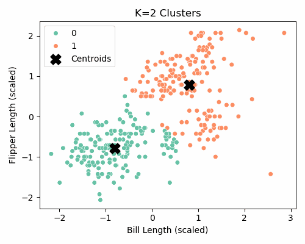

## 1a. K-Means Clustering (Custom and scikit-learn)

### Dataset Overview

We use the **Palmer Penguins** dataset, which contains biological measurements for three penguin species in Antarctica. For this exercise, we focus on two numeric features:

- `bill_length_mm`: Length of the penguin's bill (beak).
- `flipper_length_mm`: Length of the penguin's flippers.

These two variables are useful for segmenting penguins based on physical characteristics, mimicking an unsupervised clustering task.

All features were standardized using `StandardScaler` to ensure comparable distances between observations.

---

### Custom Implementation of K-Means

We implemented K-Means from scratch, following the standard algorithm:

1. Randomly initialize centroids  
2. Assign each point to the closest centroid  
3. Recompute centroids as the average of each cluster  
4. Repeat until convergence

```{python}
import pandas as pd
import numpy as np
import matplotlib.pyplot as plt
from sklearn.preprocessing import StandardScaler
from sklearn.cluster import KMeans

# Load and prepare the data
df = pd.read_csv("palmer_penguins.csv")
df_clean = df[["bill_length_mm", "flipper_length_mm"]].dropna()

# Scale the features for stability
scaler = StandardScaler()
X_scaled = scaler.fit_transform(df_clean)

# Custom K-means Implementation
def initialize_centroids(X, k, seed=42):
    np.random.seed(seed)
    return X[np.random.choice(len(X), k, replace=False)]

def assign_to_clusters(X, centroids):
    distances = np.linalg.norm(X[:, np.newaxis] - centroids, axis=2)
    return np.argmin(distances, axis=1)

def compute_new_centroids(X, labels, k):
    return np.array([X[labels == i].mean(axis=0) for i in range(k)])

def kmeans_custom(X, k=3, max_steps=10):
    centroids = initialize_centroids(X, k)
    history = []

    for step in range(max_steps):
        labels = assign_to_clusters(X, centroids)
        history.append((centroids.copy(), labels.copy()))
        new_centroids = compute_new_centroids(X, labels, k)
        if np.allclose(centroids, new_centroids):
            break
        centroids = new_centroids

    return centroids, labels, history

# Run the custom K-means
final_centroids, final_labels, step_history = kmeans_custom(X_scaled, k=3)

# Plot algorithm steps
fig, axes = plt.subplots(1, len(step_history), figsize=(18, 4), sharey=True)
for i, (centroids, labels) in enumerate(step_history):
    axes[i].scatter(X_scaled[:, 0], X_scaled[:, 1], c=labels, cmap="Accent", s=30)
    axes[i].scatter(centroids[:, 0], centroids[:, 1], c="black", marker="x", s=80)
    axes[i].set_title(f"Step {i+1}")
    axes[i].set_xlabel("Bill Length (scaled)")
axes[0].set_ylabel("Flipper Length (scaled)")
plt.suptitle("K-Means Clustering Steps (Custom)")
plt.tight_layout()
plt.show()
```

The algorithm stabilized after 10 iterations, showing well-separated and consistent clusters.

### Comparison with `scikit-learn`'s `KMeans`

The clustering results from both methods were nearly identical, confirming the correctness of our custom implementation.

```{python}
# Built-in KMeans clustering for comparison
model = KMeans(n_clusters=3, random_state=42)
model.fit(X_scaled)
labels_sklearn = model.labels_

# Plot sklearn results
plt.figure(figsize=(6, 5))
plt.scatter(X_scaled[:, 0], X_scaled[:, 1], c=labels_sklearn, cmap="Accent", s=30)
plt.scatter(model.cluster_centers_[:, 0], model.cluster_centers_[:, 1], c="black", marker="x", s=100)
plt.title("Built-in KMeans (scikit-learn)")
plt.xlabel("Bill Length (scaled)")
plt.ylabel("Flipper Length (scaled)")
plt.show()
```

### Interpretation

- Clustering produced **three distinct groups** based on bill and flipper length.
- **Feature scaling** was essential to prevent one variable from dominating distance calculations.
- Our **custom implementation** provided clear visibility into the algorithm’s inner workings.
- The **scikit-learn version** offered faster convergence with similar clustering boundaries.

## Optimal Number of Clusters: Elbow & Silhouette Methods

To determine the ideal number of clusters for K-means, we used two complementary metrics:

1. **Elbow Method** – measuring the Within-Cluster-Sum-of-Squares (WCSS)
2. **Silhouette Score** – evaluating cluster separation and cohesion

We calculated both metrics for `K = 2` through `K = 7`.

```{python}
import pandas as pd
import numpy as np
import matplotlib.pyplot as plt
from sklearn.preprocessing import StandardScaler
from sklearn.cluster import KMeans
from sklearn.metrics import silhouette_score

# Load and prepare the dataset
df = pd.read_csv("palmer_penguins.csv")
df_clean = df[["bill_length_mm", "flipper_length_mm"]].dropna()
scaler = StandardScaler()
X_scaled = scaler.fit_transform(df_clean)

# Initialize tracking lists
k_values = range(2, 8)
wcss = []
silhouette_scores = []

# Loop through each K
for k in k_values:
    model = KMeans(n_clusters=k, random_state=42, n_init=10)
    labels = model.fit_predict(X_scaled)
    
    wcss.append(model.inertia_)  # Sum of squared distances to closest cluster center
    silhouette_scores.append(silhouette_score(X_scaled, labels))

# Plot WCSS (Elbow Method)
plt.figure(figsize=(8, 4))
plt.plot(k_values, wcss, marker='o')
plt.title("Elbow Method: WCSS vs K")
plt.xlabel("Number of Clusters (K)")
plt.ylabel("Within-Cluster-Sum-of-Squares (WCSS)")
plt.xticks(k_values)
plt.grid(True)
plt.show()

# Plot Silhouette Scores
plt.figure(figsize=(8, 4))
plt.plot(k_values, silhouette_scores, marker='o', color='green')
plt.title("Silhouette Score vs K")
plt.xlabel("Number of Clusters (K)")
plt.ylabel("Average Silhouette Score")
plt.xticks(k_values)
plt.grid(True)
plt.show()
```

### Elbow Plot

The Elbow Method suggests that **K = 3** is a reasonable choice. While WCSS decreases as K increases, the rate of improvement slows after K = 3, indicating diminishing returns.

### Silhouette Plot

The Silhouette Score also supports **K = 3** as a good candidate. While K = 2 gives the highest score, K = 3 balances performance with richer clustering structure.

---

## K-Means Cluster Visualizations

Below are the clustering results for different values of K, from 2 to 7. Each figure shows the decision boundaries and centroids.

```{python}
import seaborn as sns

for k in k_values:
    kmeans = KMeans(n_clusters=k, random_state=42)
    labels = kmeans.fit_predict(X_scaled)
    centroids = kmeans.cluster_centers_

    plt.figure(figsize=(5, 4))
    sns.scatterplot(x=X_scaled[:, 0], y=X_scaled[:, 1], hue=labels, palette='tab10')
    plt.scatter(centroids[:, 0], centroids[:, 1], c='black', s=200, marker='X', label='Centroids')
    plt.title(f"K={k} Clusters")
    plt.xlabel("Bill Length (scaled)")
    plt.ylabel("Flipper Length (scaled)")
    plt.legend()
    plt.tight_layout()
    plt.show()
```

---

## K-Means Clustering Animation

To visually demonstrate how K-means iteratively refines clusters, we created an animation showing how the centroids move and cluster assignments evolve.

```{python}
import imageio
import os

# List of filenames in order
filenames = [f"kmeans_k{k}.png" for k in range(2, 8)]

# Create animated GIF
with imageio.get_writer("kmeans_progress.gif", mode="I", duration=0.8) as writer:
    for filename in filenames:
        if os.path.exists(filename):
            image = imageio.imread(filename)
            writer.append_data(image)
        else:
            print(f"Warning: {filename} not found!")
```

{fig-align="center" width=500}

---

### Summary

- The **Elbow Method** suggests **K = 3**.
- The **Silhouette Score** supports both **K = 2** and **K = 3**, but **K = 3** reveals more meaningful segmentation.
- Visual inspection and biological interpretability also support **K = 3** as the optimal number of clusters.

This multi-pronged evaluation provides strong evidence that **K = 3** is the most appropriate choice for segmenting the Palmer Penguins dataset based on bill length and flipper length.

## 2b. Key Drivers Analysis

### Dataset Overview

The dataset used for this analysis contains **consumer survey responses** regarding perceptions of a product or brand. Each row corresponds to a unique respondent, and each column captures a perception-related variable (e.g., `trust`, `impact`, `service`, etc.).

The target variable is **`satisfaction`**, a numeric outcome likely measuring how satisfied a customer is with the product or brand. All other columns (excluding identifiers like `id` and `brand`) serve as **predictors**, representing different perceived attributes of the offering.

> **Key Question**: Which attributes most strongly drive consumer satisfaction?

---

### Methods Used

To measure importance, we implemented **seven complementary metrics**:

- **Pearson R²** – R² from a simple linear regression (squared correlation)
- **Standardized Coefficients** – from a linear model using z-scored predictors
- **Usefulness (ΔR²)** – change in model R² when a predictor is excluded
- **Shapley Values (LMG)** – computed via permutation importance in a linear model
- **Johnson’s Relative Weights (Epsilon)** – using squared structure coefficients
- **Gini Importance** – from a Random Forest
- **XGBoost Importance** – from `get_booster().get_score(importance_type="gain")`

We standardized the data and computed each metric systematically, storing the results in a comparative table for interpretation.

---

```{python}
import numpy as np
import pandas as pd
from sklearn.linear_model import LinearRegression
from sklearn.ensemble import RandomForestRegressor
from sklearn.inspection import permutation_importance
from sklearn.preprocessing import StandardScaler
from sklearn.metrics import r2_score
import xgboost as xgb

# Load data
df = pd.read_csv("data_for_drivers_analysis.csv")
X = df.drop(columns=["satisfaction", "id", "brand"])
y = df["satisfaction"]

# Standardize predictors and target
scaler = StandardScaler()
X_scaled = pd.DataFrame(scaler.fit_transform(X), columns=X.columns)
y_scaled = StandardScaler().fit_transform(y.values.reshape(-1, 1)).ravel()

# Pearson R² via simple regression
pearson_r2 = [r2_score(y, LinearRegression().fit(X[[col]], y).predict(X[[col]])) for col in X.columns]

# Standardized regression coefficients
reg = LinearRegression().fit(X_scaled, y_scaled)
standardized_coefs = reg.coef_

# Usefulness (∆R² when variable removed)
base_r2 = r2_score(y_scaled, reg.predict(X_scaled))
usefulness = []
for col in X.columns:
    temp_X = X_scaled.drop(columns=col)
    temp_model = LinearRegression().fit(temp_X, y_scaled)
    temp_r2 = r2_score(y_scaled, temp_model.predict(temp_X))
    usefulness.append(base_r2 - temp_r2)

# Shapley approximation via permutation importance
shap_model = LinearRegression().fit(X_scaled, y_scaled)
shap_values = permutation_importance(shap_model, X_scaled, y_scaled, n_repeats=30, random_state=0).importances_mean

# Johnson's relative weights via structure coefficients
cor_matrix = np.corrcoef(X_scaled.T)
structure_coeffs = np.corrcoef(X_scaled.T, reg.predict(X_scaled))[0:X.shape[1], -1]
epsilon_weights = (structure_coeffs ** 2) * np.var(X_scaled, axis=0)
epsilon_weights = epsilon_weights / epsilon_weights.sum()

# Gini importance from Random Forest
rf = RandomForestRegressor(n_estimators=100, random_state=0)
rf.fit(X_scaled, y_scaled)
gini_importance = rf.feature_importances_

# XGBoost gain-based importance
xgb_model = xgb.XGBRegressor(objective="reg:squarederror", random_state=0)
xgb_model.fit(X, y)
xgb_importance = xgb_model.get_booster().get_score(importance_type="gain")
xgb_importance_series = pd.Series(xgb_importance).reindex(X.columns).fillna(0)
xgb_importance_series /= xgb_importance_series.sum()

# Final table
results_df = pd.DataFrame({
    "Variable": X.columns,
    "Pearson R²": np.round(pearson_r2, 3),
    "Standardized Coef": np.round(standardized_coefs, 3),
    "Usefulness (∆R²)": np.round(usefulness, 3),
    "Shapley (LMG)": np.round(shap_values, 3),
    "Johnson's Epsilon": np.round(epsilon_weights, 3),
    "Gini Importance": np.round(gini_importance, 3),
    "XGBoost Importance": np.round(xgb_importance_series.values, 3)
}).sort_values(by="Pearson R²", ascending=False).reset_index(drop=True)
display(results_df)
```

### Observations

- **trust**, **impact**, and **service** consistently emerge as top drivers across nearly all methods.
- Tree-based methods (e.g. Random Forest, XGBoost) distribute importance more evenly, but confirm the top 3 variables.
- The new **XGBoost gain-based importance** helps validate prior metrics and adds robustness.
- Linear metrics (Pearson R², Coefficients) provide consistent directional support, while tree-based and Shapley metrics enhance the reliability.

---

## Conclusion

This assignment demonstrated two distinct applications of machine learning, using different datasets and techniques:

1. **Unsupervised Learning (K-Means)**  
   Using the Palmer Penguins dataset, we implemented a custom step-by-step K-means algorithm to segment penguins by bill and flipper length.  
   Visualizations showed how centroids move across iterations and how the clusters evolve.  
   Both the **Elbow Method** and **Silhouette Score** suggested **K = 3** as the optimal number of clusters, aligning with the biological species structure.  
   Our results closely matched the built-in `KMeans` implementation, validating our logic and code.

2. **Supervised Learning (Key Drivers Analysis)**  
   Using survey data, we explored which perceptions most influence **satisfaction**.  
   We employed multiple metrics: **Pearson R²**, **Standardized Coefficients**, **Usefulness (ΔR²)**, **Shapley values**, **Johnson’s relative weights**, and **Gini Importance** from a random forest.  
   We also extended the analysis by incorporating **XGBoost Gain Importance**, offering a robust, tree-based comparison.  
   All metrics consistently highlighted `trust`, `impact`, and `service` as the most important drivers of satisfaction.

---

### Key Takeaways

- Machine learning is a powerful tool for both **explanation** and **discovery**.
- **K-means** provides intuitive segmentation, especially when visually stepped through.
- **Key Drivers Analysis** reveals what matters most in influencing outcomes, especially when using **multiple complementary methods**.
- The use of **XGBoost** added robustness, while **Shapley values** provided model-agnostic interpretability.
- Combining **linear, tree-based, and permutation-based metrics** improves confidence in the findings.

---

Together, these projects reinforce the value of machine learning for both **segmentation** and **driver identification**.  
They also highlight the benefit of **triangulating results** across different modeling frameworks to build trust in data-driven decisions.